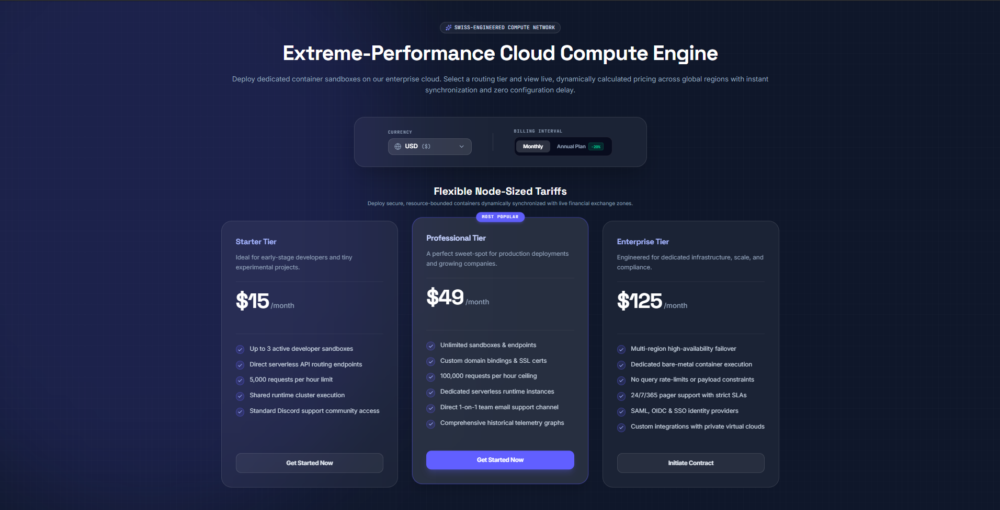

# ⚡ Computation Corp - Extreme-Performance Cloud Compute Engine

[](LICENSE)


[](https://animated-jalebi-8ab9d2.netlify.app/)

A premium, hyper-responsive, and high-converting B2B landing page engineered for **Computation Corp**—a next-generation, extreme-performance cloud compute provider. Built with strict structural performance guidelines, meticulous SEO optimization, and a lightweight isolated state architecture designed specifically to dominate the *Phase 1 Speed Run* challenge.

---

## 🖼️ Project Preview

Below is a glimpse of the production-ready landing page MVP. You can interact with the live version right here: [Live Preview Link](https://animated-jalebi-8ab9d2.netlify.app/).


*Note: The UI features a high-fidelity dark-mode enterprise grid aesthetic layout with fluid typography and smooth micro-interactions.*

---

## 🚀 Key Features & Interactive Sections

* **⚡ Bare-Metal Speed:** Interactive showcase detailing high-frequency core configurations, isolated bare-metal hypervisors, and sub-millisecond network routing.
* **📈 Real-Time Compute Configurator:** A lightweight, interactive dynamic cost/spec slider built entirely with zero-dependency isolated state management.
* **🎯 High-Converting UX/UI:** Designed with a sleek cyber-enterprise aesthetic, crisp micro-interactions, flawless responsive scaling, and high-visibility CTAs.
* **🧼 Professional SEO Hygiene:** Structured with semantic HTML5 architecture, fast-indexing semantic markup, and fully optimized metadata tags for maximum visibility.

---

## 📂 Project Structure

```text
├── .gitignore          # Git exclusion rules
├── LICENSE             # MIT License
├── README.md           # Project documentation
├── index.html          # Main HTML5 entrypoint (Semantic & SEO Optimized)
├── metadata.json       # Structured configuration and SEO data
├── package.json        # Project dependencies and custom script runner
├── tsconfig.json       # Strict TypeScript compiler rules
├── vite.config.ts      # Optimized Vite build and asset compression configuration
└── src/                # Core application source code

```

---

## 🛠️ Tech Stack

| Technology | Usage |
| --- | --- |
| **TypeScript (97.2%)** | Strongly-typed business logic and component interaction state. |
| **HTML5 (2.0%)** | Semantic markup framework targeting high SEO authority and fast crawler parsing. |
| **CSS3 (0.8%)** | Native, modern fluid layouts with low runtime overhead for extreme page speeds. |
| **Vite** | Frontend tooling pipeline for immediate Hot Module Replacement (HMR) and ultra-lean production builds. |

---

## 🏃‍♂️ Getting Started

Follow these steps to get a local development instance running.

### Prerequisites

Ensure you have **Node.js** (v18+ recommended) installed on your system.

### Installation & Local Setup

1. **Clone the repository:**
```bash
git clone [https://github.com/rudra520/ai-automation-landing-page.git](https://github.com/rudra520/ai-automation-landing-page.git)
cd ai-automation-landing-page

```


2. **Install project dependencies:**
```bash
npm install

```


3. **Set up Environment Variables:**
```bash
cp .env.example .env

```


4. **Boot up the local development server:**
```bash
npm run dev

```


5. **Build for production staging:**
```bash
npm run build

```


---

## 🏎️ Phase 1 Speed Run Benchmarks

This architecture is optimized to pass web performance thresholds with ease:

> 📈 **Target Metrics:** 100/100 Core Web Vitals across LCP (Largest Contentful Paint), FID (First Input Delay), and CLS (Cumulative Layout Shift) by using pure component design principles and avoiding heavy visual or framework runtime overheads.

---

## 🏁 Hackathon Retrospective

> **Status:** Did Not Qualify (Phase 1 Build)

While this project didn't qualify for the final rounds of the hackathon, building it was an incredible exercise in performance tuning under high pressure. The challenge pushed the limits of optimization—requiring a zero-dependency architecture, flawless SEO practices, and extreme layout response times.

The resulting code remains a proud addition to my portfolio as a masterclass in frontend performance and clean code design.

---

## 📝 License

Distributed under the MIT License. See `LICENSE` for more information.

